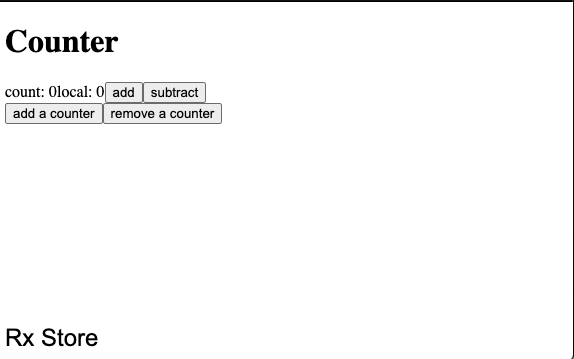
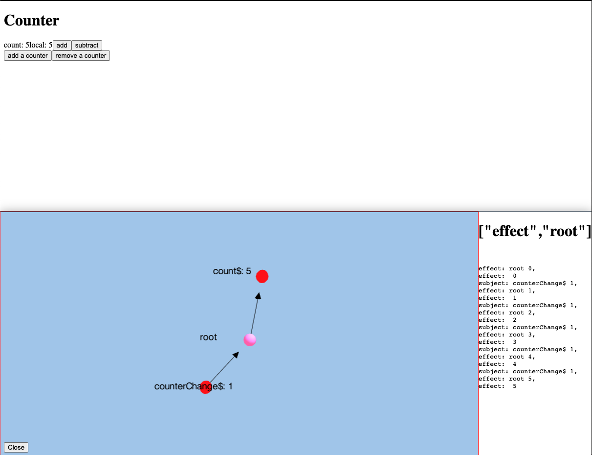

## Installing

Currently the devtools are a "beta" tool, to use them you must mount a React component in your app. In the future, we'll package something like an electron app / Chrome devtools extension.

To use the devtools, create a `devtools$` RxJS subject, and pass it to both the store & the `<Devtools />` component.

```ts
import { Devtools } from '@rx-store/devtools';
import { store } from '@rx-store/react';
import { appRootEffect as effect } from './store/effects';
import { ReplaySubject } from 'rxjs';
import { StoreEvent } from '@rx-store/core';

// create an RxJS subject for the "store events"
export const devTools$ = new ReplaySubject<StoreEvent>(5000);

export const { Manager, context } = store({
  value,
  effect,
  // pass in the devtools subject to the store
  observer: devTools$,
});

ReactDOM.render(
  <React.StrictMode>
    <Manager>
      <>
        <App />
        // render the devtools component, the closer to the top of the app the better!
        <Devtools observable={devTools$} />
      </>
    </Manager>
  </React.StrictMode>,
  document.getElementById('root')
);
```

## Screenshots

Devtools will render a toggle in the lower left of the app.



The opened devtools will show a live graph visualization on the left, and logs on the right. Click on the nodes of the graph to filter the logs. Marbles will "shoot" from one node to another when data flows. Arrows show which effect(s) spawned each other, and where data can flow, based on which sources and sinks each effect accessed, and the values emitted therein.



## Options

- `initialIsOpen: Boolean`
  - Set this `true` if you want the dev tools to default to being open
- `panelProps: PropsObject`
  - Use this to add props to the panel. For example, you can add `className`, `style` (merge and override default style), etc.
- `closeButtonProps: PropsObject`
  - Use this to add props to the close button. For example, you can add `className`, `style` (merge and override default style), `onClick` (extend default handler), etc.
- `toggleButtonProps: PropsObject`
  - Use this to add props to the toggle button. For example, you can add `className`, `style` (merge and override default style), `onClick` (extend default handler), etc.
- `position?: "top-left" | "top-right" | "bottom-left" | "bottom-right"`
  - Defaults to `bottom-left`
  - The position of the React Query logo to open and close the devtools panel

## How it works

The Rx Store API allows Rx Store to collect the information it needs as the data flows around.

Rx Store is able to know, prior to subscribing, which effects consume from which subjects, which subjects each effect can emit onto, and anytime an effect spawns an inner effect, anytime that errors or completes, and it knows when an effect receives a value from whence subject it came as well as the value, and it knows exactly when effects emit and onto which subjects. This is all made possible via curried sources, sinks, and spawnEffect, and a recursive tree like structuring of effects allowing Rx Store to keep track of a "stack trace"

Effects accept these arguments, destructured from an object:

`sources` like inputs, these are functions that return observables
`sinks` like outputs, these are operators that sink values emitted on the source observable to the subjects
`spawnEffect` function used to spawn effects, eg. projecting inner observables & letting Rx Store track the lifecycle of the higher order streams

They are passed in as an object to your effects. Example:

```ts
export const effect = ({ sources, sinks }) =>
  sources.count$().pipe(delay(1000), sinks.countCopy$());
```

Each instance of the effect is tracked, and as the data flows in & out we are able to track it. Consumers can wrap inner observables eg. with switchMap() using the spwanEffect() helper, and Rx Store will be able to track where an effect was spawned from all the way up to the root, like a stack trace, example:

```ts
export const counter: RxStoreEffect<AppContextValue> = ({
  sources,
  sinks,
  spawnEffect,
}) =>
  sources.counterChange$().pipe(
    switchMap(() => spawnEffect(() => timer(0, 1000), { name: 'timer' })),
    sinks.count$()
  );
```

The `spawnEffect` helper takes 2 arguments:

`effect` - an effect function (function accepting the {sources,sinks,spawnEffect} object), this is required.
`options` - an object where you can pass an optional name (auto naming functionality is TODO)

Example:

```ts
export const appRootEffect: RxStoreEffect<AppContextValue> = ({
  spawnEffect,
}) =>
  merge(
    spawnEffect(time, { name: 'time' }),
    spawnEffect(counter, { name: 'counter' })
  );
```

An object is used to wrap the name passed to spawnEffect, this allows for adding more information like tags or other fields used to configure devtools in the future.
